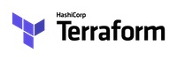
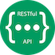
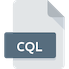
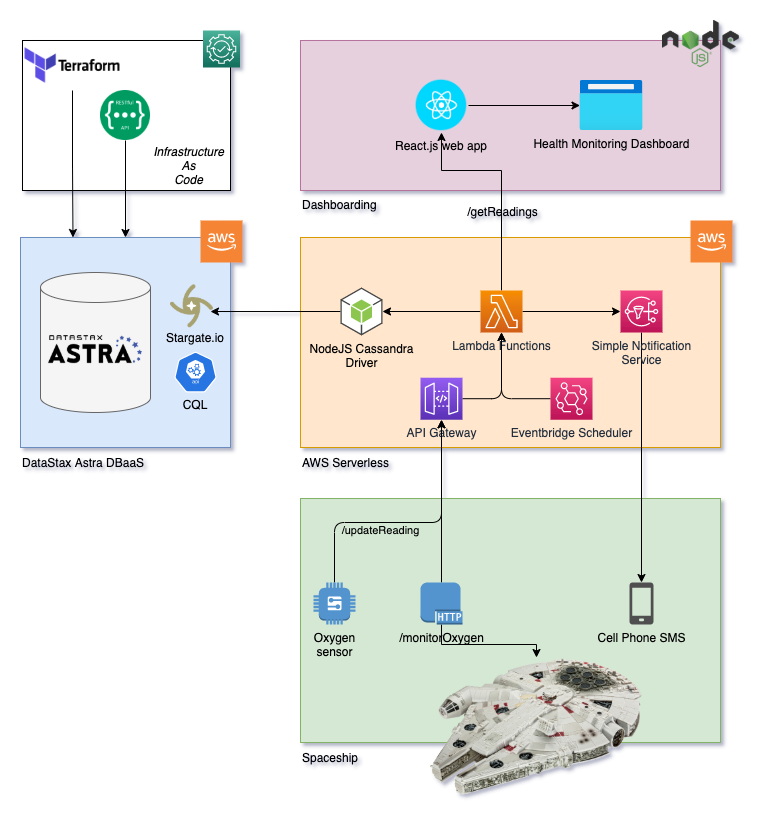
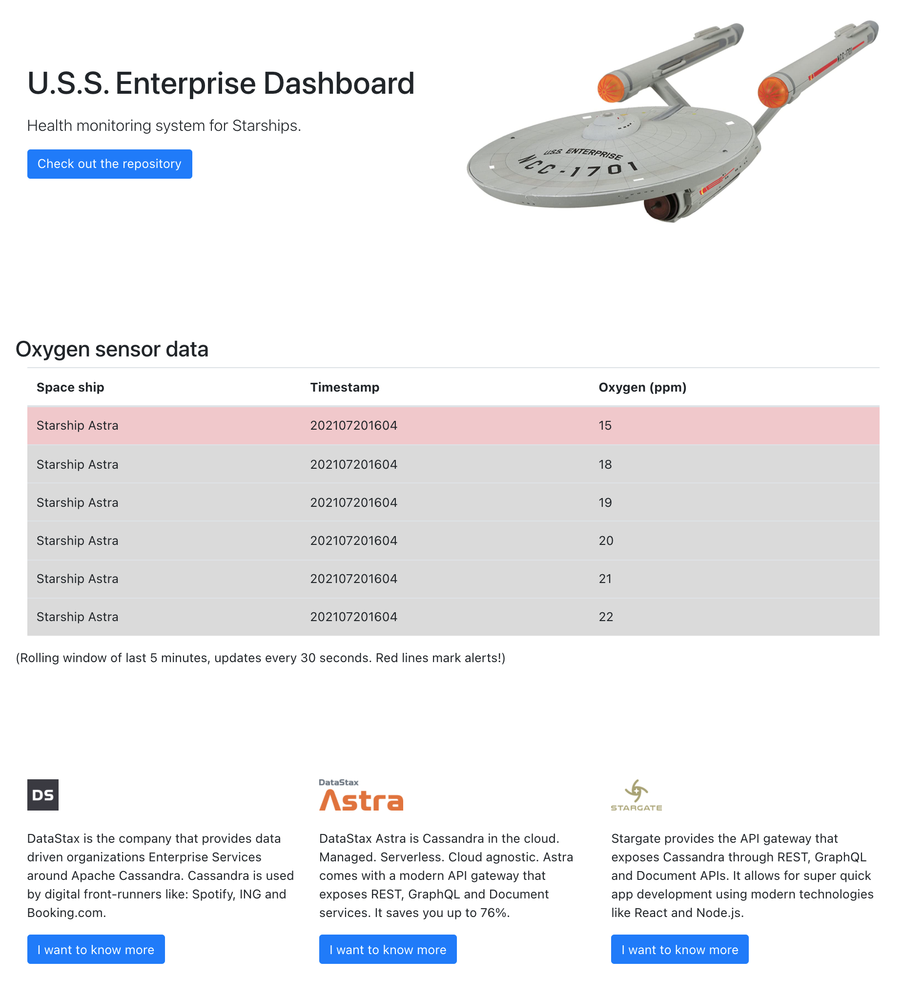

# 🚀 Starship Enterprise IOT Demo 🚀

## Technology used
This demo is a functionality and technology showcase around [DataStax Astra](https://astra.datastax.com) with the following technology:









## Narrative
Welcome to the Starship Enterprise Fleet! And congratulations, you're the Safety Manager responsible for the safety of all personnel.  
The single most important safety issue is the quality of oxygen. No oxygen == No people!  
In order to maximise safety on each ship an extensive monitoring system has been implemented by you for life support.

The monitoring system takes information from thousands of sensors and stores it securely in the serverless elastically scalable [DataStax Astra](https://astra.datastax.com) database.
Astra is a managed Cassandra cloud-agnostics database and has been choosen because of it's zero-downtime capabilities. It's lightning fast write operations allowing for secure storage of all measurements of all IOT sensors. And as we're not just talking Global scale, but Universal scale, we need a database that can scale with us!

The ultime goal here is to create a full serverless application that utilizes the serverless DataStax Astra database and AWS Lambda functions as follows:



## 1️⃣ Components in the demo
### Database
The database being used is deployed on the Datastax Astra DBaaS offering because of:
- No Ops, No Scaling, just use it in a serverless fashion!
- Cloud native
- Zero lock-in
- Global (Universal in our case!) scale

In this repo both the CQL and Stargate.io REST interfaces have been utilized.

### IOT data provider
The most important factor to measure is the quality of the oxygen in the spaceship!  
For this type of IOT data we utilize JMeter serving as an IOT sensor simulator sending it's data towards the database.

### Monitoring
Once we have measurements, it's time to start monitoring.  
In our situation, we have decided to monitor for outliers during a roling window of one minute.  
Normal oxygen levels measure 18-22 ppm. Everything below 17 ppm activates an alert event.

### Alerting
Because the maintenance personnel is very actively working throughout the whole ship, we have to make sure they get alerted as soon as action has to be taken. 
#### AWS cloud-native app 
To keep in-line with the cloud-based Astra solution, we utlize the following cloud-native solutions on AWS:
- AWS Lambda functions to create a true severless application.
- Additionally the AWS Simple Notification Service is used to inform service employees.
- Finally AWS Lambda Scheduled Events to run the service every minute.  
In order to package the application nicely in a devops environment [Serverless]https://serverless.com has been used.  
The serverless functions call the Astra Database uzing Stargate APIs.

#### Python app
For reference, and showing the flexibility of the Datastax platform, there is also a Python app that monitors the sensor information and triggers alerts when needed.

### Dashboarding
Operations needs a lot of information about the fleet as well. For them we've created a Responsive Web Application that provides a rolling window of 5 minutes if sensor information.

## 2️⃣ Data model design
### Keyspace
In order to group all information of the life support systems together, we'll utilize the keyspace `life_support_systems`.
### Table structure
For the design of the table structure, the user-experience-based design principles are being used.  
This means we design the table based on it's usage patterns. In our case the following aspects have to be taken care of:
- Monitoring runs every minute, utilizing a roling window of a minute to find outliers
- Within the space ship there will be thousounds of IOT devices
The partition key therefore will be based on:
- `yymmddhhmm` (in order to easily find all data for a roling minute window)
- The `name of the ship`
- The `name of the sensor`
Because we want to find outliers easily, it will be helpful to group and sort the data based on oxygen level. Therefore the clustering key will be based on:
- `oxygen level in ppm`
All of this results in the following table structure:
```sql
CREATE TABLE IF NOT EXISTS sensor_data (
  yyyymmddhhmm text,
  updated timestamp,
  ship text,
  sensor text,
  reading int,
  PRIMARY KEY ((yyyymmddhhmm, ship, sensor), reading)
) WITH CLUSTERING ORDER BY (reading ASC);
```
The primary key consists of the combined attributes `yyyymmddhhmm`, `ship` and `sensor` to be able to find the relevant data quickly as this data will be stored on one partition. Additionally we place a clustering key on `reading` in ascending order so that the data gets sorted. This allows to limit the results to the first row, again speeding up the read activity, because the first row will contain the lowest value for `reading`.

### Query
We want to quickly know if there is an outlier during the last rolling window of a minute. The easiest way to do this is utilizing the partition keys and clustering key.
```sql
SELECT reading FROM sensor_data
WHERE yyyymmddhhmm = '202008161202' AND ship = 'Starship Astra' AND sensor = 'oxygen'
LIMIT 1;
```
This will retrieve all oxygen reading from the current rolling minut window, with the oxygen value sorted in an ascending order. So the smallest value will be first, easily allowing to check if it's < 18. Limiting to 1 gives us the number we're interested in.

## 3️⃣ Setting up Astra
> **TECHNOLOGY**  
> ✅ Terraform  
> ✅ Astra REST API

For purposes of showing off, we're going to utilize several methods for setting up the Astra database.
1. First we'll use [Terraform](https://www.terraform.io) using the [DataStax Astra Provider](https://registry.terraform.io/providers/datastax/astra/latest/docs) to create the database in the region of our choice.
2. Then we'll use the [REST API](https://docs.datastax.com/en/astra/docs/getting-started-with-datastax-astra.html) to create the table.

All Terraform activities are relative to the `./terraform` directory!

### Set up Terraform
This guide assumes a Mac OSX environment:
```sh
brew tap hashicorp/tap
brew install hashicorp/tap/terraform
brew update
brew upgrade hashicorp/tap/terraform
```
Validate the installation by running:
```sh
terraform -help
```

### Grab and set the security token for your Astra database
Go to [Astra Token Management](https://astra.datastax.com/org/a056b285-9d65-430a-bf68-3778e99f8a6c/settings/tokens) and create a new security token. To make life simple, for now we'll create an *Administrator User* role. Make sure you save the `.csv` file for later reference.

Now set the environment variable `ASTRA_API_TOKEN` so it can be used by Terraform:
```sh
export ASTRA_API_TOKEN=<your-token>
```

### Configure the Astra provider for Terraform
Create a file called `main.tf` and paste the following:
```js
// Define the Astra provider for Terraform
terraform {
  required_providers {
    astra = {
      source = "datastax/astra"
      version = "0.0.5-pre"
    }
  }
}

// Provide your Astra token
provider "astra" {
    // Will read from environment variable ASTRA_API_TOKEN, else define as follows:
    // token =
}
```
Then run `terraform init`.

### Choose your Astra cloud provider and region
With Astra you have a choice of running your database on either AWS, GCP or Azure and within a choice of regions as well. To find out which regions are available, add the following to `main.tf`:
```js
// Get the regions that are available within Astra
data "astra_available_regions" "regions" {
}

// Output the regions
output "available_regions" {
  value = [for region in data.astra_available_regions.regions.results : "${region.cloud_provider}, ${region.region}, ${region.tier}" if region.tier == "serverless"]
}
```
Now run `terraform plan` and note the cloud providers and their regions.

### Create a new database
Pick a cloud provider and region from the previous list. As we'll create a fille serverless stack and will use [AWS Lambda](https://aws.amazon.com/lambda/) it makes sense to choose *AWS* as the cloud provider and the region where you'll run your serverless functions. In our case those are:
- Cloud provider: AWS
- Region: eu-central-1

With this information create the following `main.tf`:
```js
// Define the Astra provider for Terraform
terraform {
  required_providers {
    astra = {
      source = "datastax/astra"
      version = "0.0.5-pre"
    }
  }
}

// Provide your Astra token
provider "astra" {
    // Will read from environment variable ASTRA_API_TOKEN, else define as follows:
    // token =
}

// Create the database and initial keyspace
resource "astra_database" "dev" {
  name           = "starship_enterprise"
  keyspace       = "life_support_systems"
  cloud_provider = "AWS"
  region         = "eu-central-1"
}

// Get the location of the secure connect bundle
data "astra_secure_connect_bundle_url" "dev" {
  database_id = astra_database.dev.id
}

// Output the created database id
output "database_id" {
  value = astra_database.dev.id
}

// Output the download location for the secure connect bundle
output "secure_connect_bundle_url" {
  value = data.astra_secure_connect_bundle_url.dev.url
}
```
Now run `terraform plan` to see what actions are going to be taken. When you're happy, run `terraform apply` and type `yes`.

Terraform will now create the Astra database and upon completion provide:
- The database id. Take note of it!
- The download location for the secure connect bundle. It will be available for download for 5 minutes.

### Download the secure connect bundle
The secure connect bundle contains all information to set up a TLS encrypted tunnel between client and the Astra server.

Copy the URL from above and paste it here:
```sh
wget -O secure_connect_bundle.zip "<url>"
```

### Set up token and secrets to be used later on
All REST API activities are relative to the `./astra` directory!

First set up the environment variables:
1. Edit `astra_environment.txt` to match the Astra Cluster ID and Region.
2. Create a file `astra_token.txt` that contains the token you previously generated:
```sh
export ASTRA_DB_APPLICATION_TOKEN=<your-token>
```
3. Create a file `astra_credentials.txt` that contains the Client Id and Client Secret you generated while creating a token:
```sh
export ASTRA_CLIENT_ID=<your-client-id>
export ASTRA_CLIENT_SECRET=<your-client-secret>
```

### Create the necessary tables
Run: `./createTables.sh`. Take a look at the embedded REST call.  
This will first drop and then create the oxygen_filter table that accepts information from the oxygen IOT sensor.

### Add some test rows into the table
Run: `./addRows.sh`. Take a look at the embedded REST call.

### Test querying the sensor table
Run: `./query.sh`. Take a look at the embedded REST call.  
Take note of the automatic order done by the cluster!

## 4️⃣ Simulate the oxygen IOT device
> **TECHNOLOGY**  
> ✅ JMeter  
> ✅ Astra REST API

### IOT data generation
In 98% of the time we generate a normal O value of 18-22, the other 2% we generate outliers from 14-17.  
One IOT data point per second is generated as follows in the JMeter HTTP thread definition calling the Astra REST endpoint:  
```json
${__setProperty(time, ${__time(yyyy-MM-dd HH:mm:ss.S)}, False)}
${__setProperty(yyyymmddhhmm, ${__time(yyyyMMddHHmm)}, False)}

{"columns":[
  {"name":"yyyymmddhhmm","value":"${__P(yyyymmddhhmm)}"},
  {"name":"updated","value":"${__P(time)}"},
  {"name":"ship","value":"Starship Astra"},
  {"name":"sensor","value":"oxygen"},
  {"name":"reading","value":${__javaScript(${__Random(0,100)} > 98 ? ${__Random(14,17)} : ${__Random(18,22)})}}
]}
```

### Spin up JMeter and hit the rows endpoint to load IOT data
In this demo we'll use JMeter to simulate a data feed coming from an oxygen level sensor in the filter room of the life support system in the space ship.  
1. Run `apache-jmeter-5.3/bin/jmeter.sh` and load `Oxygen Filter Simulation.jmx`.  
2. Update the `Connection Settings` in the testplan to match the Astra Database and Token.
3. Hit the run button to start the simulation that loads IOT data into Astra. JMeter will ingest a value every second for a period of 5 minutes (enough for testing).

## 5️⃣ Python Monitoring App
> **TECHNOLOGY**  
> ✅ Python  
> ✅ Cassandra driver  
> ✅ CQL

All activities are relative to the `./python-monitoring` directory!

### Design
Secrets are taken from the `./astra/credentials.txt` file.  
The app connects to Astra using the Secure Connect Bundle.  
Every 5 seconds the app checks if there is an outlier in the oxygen values for the rolling minute window. This is scheduled using the `schedule` package.  
The query we use is documented above. Whenever we retrieve a value that is smaller than 18, an alert goes off.

### Run the IOT monitoring process
Make sure your Astra secrets are correctly stored in `./astra/credentials.txt`. 
Now install the cassandra driver and schedule: `pip3 install cassandra-driver schedule`.  
Optional: Check the cassandra driver availability: `python3 -c 'import cassandra; print (cassandra.__version__)'`.  
Make sure JMeter is firing the endpoint to simulate the oxygen sensor.    
Now run `./run_monitoring.sh` and see the magic happen.

## 6️⃣ AWS cloud-native Monitoring App
> **TECHNOLOGY**  
> ✅ AWS S3  
> ✅ AWS Lambda  
> ✅ AWS SNS (Simple Notification Service)  
> ✅ Astra REST API  
> ✅ Node.js  
> ✅ Curl

All activities are relative to the `./aws-monitoring` directory!

### Design
The cloud-native solution uses a full serverless design. No need for provisioning compute nodes anymore!  
To ease the devops process, we make use of the wunderful https://serverless.com framework.

As we're running a safety monitoring application we want latencies to be as low as possible. Therefore make sure you deploy your Serverless Functions to the same region where your Astra Database is running.

After deploying the following endpoints will be available (where the URL is dynamic of course):
- POST - https://f8nfklyolb.execute-api.eu-central-1.amazonaws.com/dev/createSchema
- POST - https://f8nfklyolb.execute-api.eu-central-1.amazonaws.com/dev/addSensorReading
- GET - https://f8nfklyolb.execute-api.eu-central-1.amazonaws.com/dev/getReading
- POST - https://f8nfklyolb.execute-api.eu-central-1.amazonaws.com/dev/test/send
- GET - https://f8nfklyolb.execute-api.eu-central-1.amazonaws.com/dev/monitorOxygen

These endpoints have been programmed using Node.js and are available in `handler.js`.

### Set up Serverless and deploy to AWS
1. `npm install -g serverless` (make sure you have [Node.js LTS](https://nodejs.org/en/) installed)
2. Go to [AWS](https://aws.amazon.com/) and login into your account. Then create an IAM user for serverless (Programmatic Access and AdministratorAccess policy). Note the credentials.
3. Configure AWS credentials for Serverless like `serverless config credentials --provider aws --key <KEY> --secret <SECRET>`.
4. Browse to AWS and create an *AWS S3 bucket* (make sure to use the same region as your Astra Database). This is where your serverless code will be deployed.
5. Configure your *AWS SNS Service* SMS sandbox to allow messages to be sent to your Cell Phone Number. 
6. Configure the region and bucket in `serverless.yml`.
```yaml
  region: eu-central-1
  deploymentBucket:
    name: astra-starship
```
7. Make the Secure Connect Bundle available for packaging by copying it from the `terraform` directory to the `aws-monitoring` directory by running `cp ../terraform/secure_connect_bundle.zip .`.
8. Configure the secrets of the Astra database in `serverless.yml`. Also configure your Cell Phone Number for recieving SMS messages:
```yaml
  environment:
      ASTRA_SECURE_CONNECT_BUNDLE: secure_connect_bundle.zip
      ASTRA_CLIENT_ID: <your-client-id>
      ASTRA_CLIENT_SECRET: <your-client-secret>
      ASTRA_DB_APPLICATION_TOKEN: <your-token>
      MONITOR_SMS_NUMBER: +31612345678
```
9. Install Node.js dependencies
```sh
npm install @astrajs/collections @astrajs/rest@0.0.12 aws-sdk --save
```
10. Deploy the serverless functions running `sls deploy`.

### Debugging the serverless functions
Find *Cloud Watch* on AWS and click on *Log Groups*. Here you will find logs for your functions.

### Create the oxygen_filter table in the life_support_systems keyspace (if not done already, or drop it)
Call the AWS Lambda REST endpoint (replace the URL to match your instance):
```sh
curl -X POST https://f8nfklyolb.execute-api.eu-central-1.amazonaws.com/dev/createSchema
```

### Add some test data (for the demo, use JMeter explained above)
Call the AWS Lambda rest endpoint:
```sh
curl -X POST -d '{"yyyymmddhhmm": "202008161210", "updated": "2020-08-16T12:10:31.020Z", "ship": "Starship Astra", "sensor": "oxygen", "reading": 18}' https://f8nfklyolb.execute-api.eu-central-1.amazonaws.com/dev/addSensorReading
curl -X POST -d '{"yyyymmddhhmm": "202008161210", "updated": "2020-08-16T12:10:31.021Z", "ship": "Starship Astra", "sensor": "oxygen", "reading": 20}' https://f8nfklyolb.execute-api.eu-central-1.amazonaws.com/dev/addSensorReading
curl -X POST -d '{"yyyymmddhhmm": "202008161210", "updated": "2020-08-16T12:10:31.022Z", "ship": "Starship Astra", "sensor": "oxygen", "reading": 17}' https://f8nfklyolb.execute-api.eu-central-1.amazonaws.com/dev/addSensorReading
```

### Test querying the test data
Call the AWS Lambda rest endpoint for a specific rolling time window, a specific ship and a specific sensor:
```sh
curl -X POST -d '{"yyyymmddhhmm": "202008161210", "ship": "Starship Astra", "sensor": "oxygen"}' https://f8nfklyolb.execute-api.eu-central-1.amazonaws.com/dev/getReading
```

### Test sending an SMS
Call the rest endpoint which on it's turn cals the SNS service of AWS to send an SMS:
```sh
curl -X POST -d '{"receiver": "+31638507567", "sender": "Starship", "message": "This is a test message"}' https://f8nfklyolb.execute-api.eu-central-1.amazonaws.com/dev/test/send
```

### Test monitoring
Make sure JMeter is firing the endpoint to simulate the oxygen sensor. Also update `MONITOR_SMS_NUMBER` in `serverless.yml` to match your cell phone number.  
Call the rest endpoint (some variables haven been hardcoded for the sake of time):
```sh
curl -X POST -d '{"ship": "Starship Astra"}' https://f8nfklyolb.execute-api.eu-central-1.amazonaws.com/dev/monitorOxygen
```

### Operationalize the monitoring process
Update `serverless.yml` and change `enabled: false` to `enabled: true` for function `monitorOxygen`. Also make sure to update `MONITOR_SMS_NUMBER` in `serverless.yml` to match your cell phone number.  
Run `sls deploy` and sit back!

***Important:*** Make sure to change enabled back to false and run another deploy. Else the monitoring app keeps running which will incur cost!

### Test the REST endpoint for the front-end
Call the AWS Lambda rest endpoint for a specific rolling time window, a specific ship and a specific sensor:
```sh
curl -X POST -d '{"ship": "Starship Astra", "sensor": "oxygen"}' https://f8nfklyolb.execute-api.eu-central-1.amazonaws.com/dev/getReadings
```

## 7️⃣ Monitoring Dashboard
> **TECHNOLOGY**  
> ✅ Node.js  
> ✅ React  
> ✅ Bootstrap  
> ✅ AWS Lambda

### Design
The front-end is based on [React](https://reactjs.org) which is a great javascript library for dynamic front-ends. [Bootstrap](https://getbootstrap.com/) is used to make the dashboard responsive and available on any device. The react code runs on top of [Node.js](https://nodejs.org/) and is broken up in several components for separation of concern.

The main component is the `SensorData` component. It's only responsibility is to show a rolling 5 minute window of readings and pointing out alert values. Functionality:
- Build the UI part of the component
- Ticker schedule to update the component every 30 seconds
- Call the /getReadings REST endpoint on the AWS Lambda middle layer

### Run the front-end
First you need to update the URL for the /getReadings API that runs on AWS Lambda because the URL is dynamic. Edit `front-end/src/SendorData.js` and replace the URL on line `27`.

Then make sure you feed values into the database by simulating load from the oxygen sensor. For this start `apache-jmeter-5.3/bin/jmeter.sh` and run `Oxygen Filter Simulation.jmx`.  

Lastly install required modules and start the server:
```sh
cd front-end
npm install
npm start
```
Your browser should open on http://localhost:3000 and look like this:

